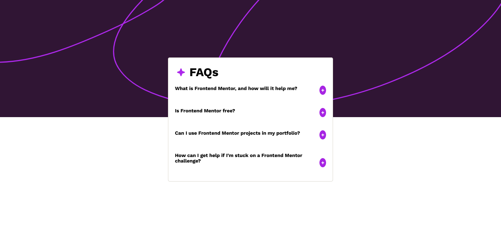

# Frontend Mentor - FAQ accordion solution

This is a solution to the [FAQ accordion challenge on Frontend Mentor](https://www.frontendmentor.io/challenges/faq-accordion-wyfFdeBwBz). Frontend Mentor challenges help you improve your coding skills by building realistic projects. 

## Table of contents

- [Overview](#overview)
  - [The challenge](#the-challenge)
  - [Screenshot](#screenshot)
  - [Links](#links)
- [My process](#my-process)
  - [Built with](#built-with)
  - [What I learned](#what-i-learned)
  - [Useful resources](#useful-resources)
- [Author](#author)

## Overview

### The challenge

Users should be able to:

- Hide/Show the answer to a question when the question is clicked
- Navigate the questions and hide/show answers using keyboard navigation alone
- View the optimal layout for the interface depending on their device's screen size
- See hover and focus states for all interactive elements on the page

### Screenshot



### Links

- Solution URL: [faq-accordion-main](https://github.com/saulgutierrez/faq-accordion-main)
- Live Site URL: [faq-accordion-main](https://spectacular-tartufo-2a0e7e.netlify.app/)

## My process

### Built with

- Semantic HTML5 markup
- CSS custom properties
- Flexbox
- Javascript

### What I learned

After pseudoclass:
```css
.active:after {
  ...
}
```

Overflow and transtion properties:

```css
.panel {
  overflow: hidden;
  transition: max-height 0.2s ease-out;
}
```

### Useful resources

- [W3Schools](https://www.w3schools.com/howto/howto_js_accordion.asp) - I've based on this article to generate and customize my own accordion, using this samples as base.

## Author

- Website - [Saúl Gutiérrez](https://sauladai.netlify.app/)
- Frontend Mentor - [@saulgutierrez](https://www.frontendmentor.io/profile/saulgutierrez)